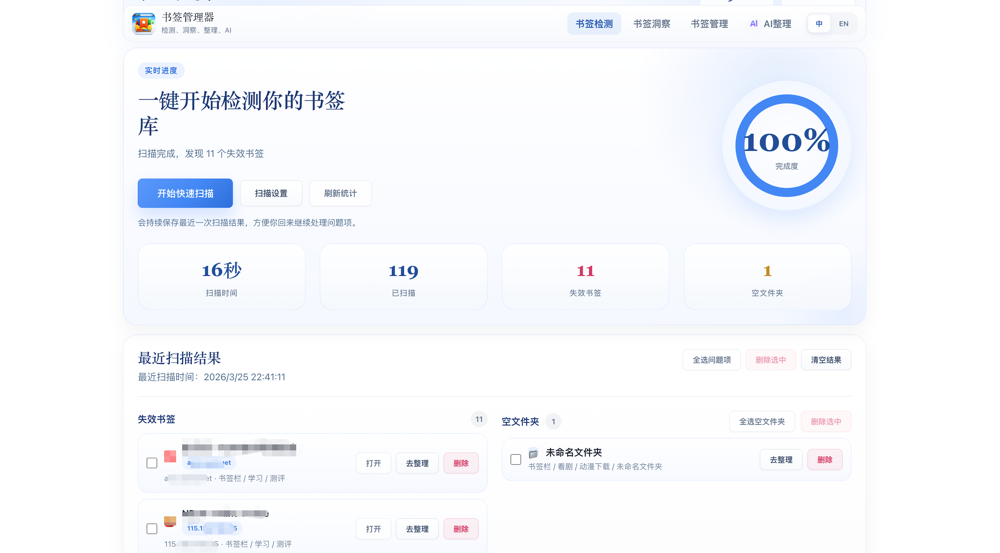
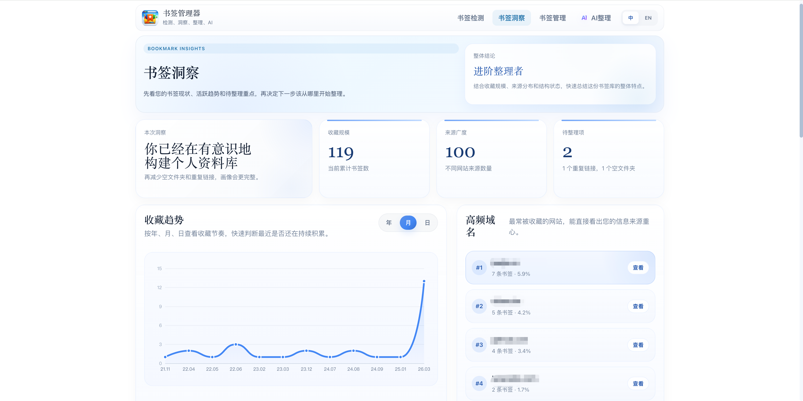
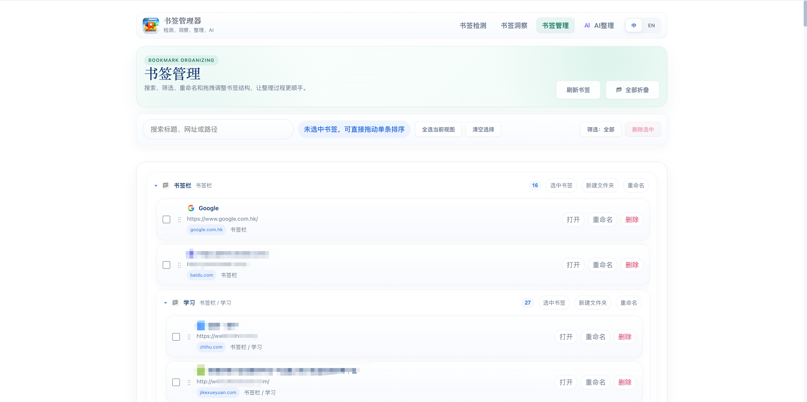
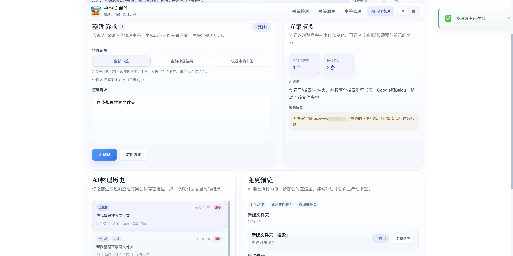

# 智能书签管家

中文 | [English](./README.md)

智能书签管家是一个用于书签检测、洞察、管理和 AI 辅助整理的 Chrome 扩展。

## 截图预览

### 书签检测

### 书签洞察

### 书签管理

### AI整理

## 功能特性

- 检测失效链接和空文件夹
- 展示趋势、常用域名和待整理重点等书签洞察
- 支持搜索、多选、重命名、删除和拖拽整理书签
- 通过 AI 生成整理方案，并支持预览、应用、撤销和历史回看
- 提供 Popup 快速扫描和轻量清理入口

## 四个核心模块

- `检测`
  - 扫描失效链接和空文件夹，并在同一处集中处理
- `洞察`
  - 查看收藏趋势、来源分布，以及最值得优先整理的地方
- `管理`
  - 搜索、筛选、重命名、删除，并通过拖拽调整书签结构
- `AI整理`
  - 用自然语言描述整理诉求，先看方案，再确认是否真正应用到书签栏

## 安装方式

1. 打开 `chrome://extensions`
2. 开启 `开发者模式`
3. 点击 `加载已解压的扩展程序`
4. 选择 `chrome-bookmark-manager` 文件夹

## AI 服务

扩展当前默认使用托管的 HTTPS AI 服务地址：

- `https://api.dogclaw.top/ai/api/bookmarks/plan`

对应的 usage 接口会基于同一路径自动推导。

## 项目结构

- `manifest.json`：扩展配置和权限
- `popup.html` / `popup.js` / `popup.css`：弹窗页面
- `profile.html` / `profile.js` / `styles.css`：主功能页
- `i18n.js`：两个页面共用的多语言词典与工具函数
- `_locales/`：商店级名称/描述本地化（默认 `zh_CN`，含 `en`）
- `background.js`：后台 service worker
- `privacy-policy.html`：隐私政策页面
- `icons/`：扩展图标

## 权限说明

- `bookmarks`
- `storage`
- `webRequest`
- `favicon`
- `host_permissions`

这些权限分别用于书签读写整理、本地设置保存、显示网站图标，以及校验书签链接是否有效。说明：打开管理器或书签链接使用的 `chrome.tabs.create` 不需要 `tabs` 权限。

## 隐私说明

扩展的大部分运行数据都保存在浏览器本地。

当您主动使用 `AI整理` 时，扩展会把当前整理范围内的信息发送到 AI 服务，包括：

- 书签标题
- 书签 URL
- 书签路径
- 文件夹标题和路径
- 您输入的整理诉求

服务端仅用于生成整理方案，不存储您的书签内容。

完整隐私政策见：

- [privacy-policy.html](./privacy-policy.html)

## 开发说明

- 兼容 Manifest V3
- 建议 Chrome 114 及以上

## 许可证

MIT
